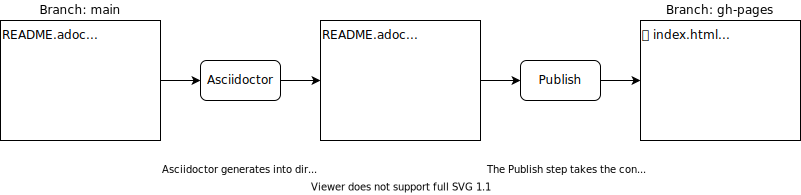

== Notes on how it works
This project takes inspiration from a https://blog.jread.com/auto-build-and-host-pretty-html-documentation-using-asciidoc-github-pages-github-actions-758a03f93d7d[blogpost by James Read]. Read this post if you want to add CSS styling or deploy on your own domain name.

The workflow contains two steps as shown below.

=== Notes on GitHub Pages action
https://github.com/peaceiris/actions-gh-pages

